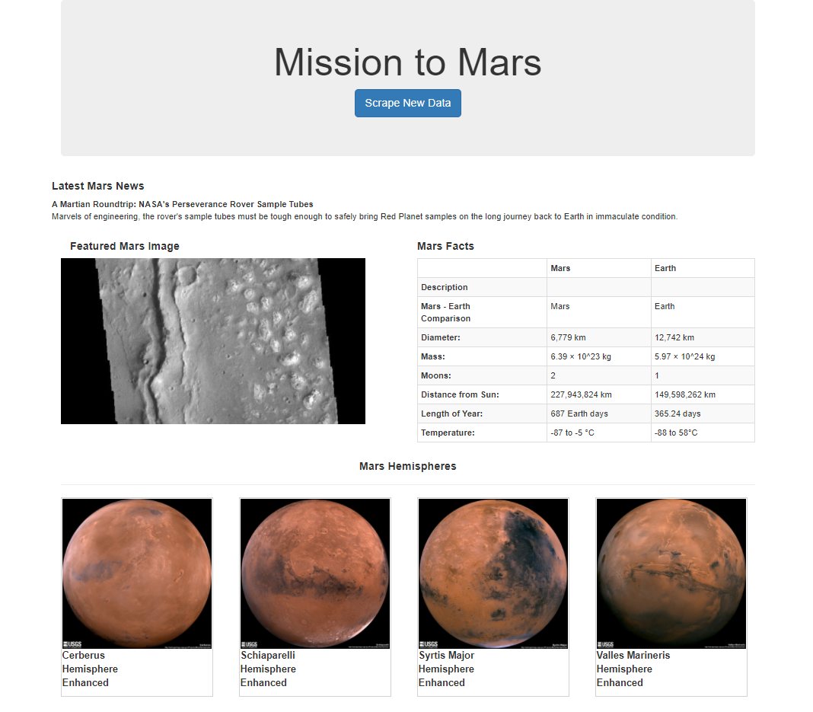

# Web-Scraping_Challenge - Mission to Mars

## Objective: 
Build a web application that scrapes various websites for data related to the Mission to Mars and displays the information in a single HTML page. 

## Step 1 - Scraping 

Initial scraping completed using Jupyter Notebook, BeautifulSoup, Pandas, and Requests/Splinter.

### Sites Scraped
* NASA Mars News (https://redplanetscience.com/)
    * Collect the latest News Title and Paragraph Text. 

* JPL Mars Space Images - Featured Image - (https://spaceimages-mars.com)
    * Collect the image url for the current Featured Mars Image with Splinter.

* Mars Facts (https://galaxyfacts-mars.com) 
    * Collect the table containing facts about the planet including Diameter, Mass, etc. with Pandas.

* Astrogeology site (https://marshemispheres.com/) to obtain high resolution images for each of Mar's hemispheres.
    * Collect high resolution images and corresponding titles for each of Mar's hemipsheres.

## Step 2 - MongoDB and Flask Application

Use MongoDB with Flask templating to create a new HTML page that displays all of the information that was scraped from the URLs above.

## Problems
Sometimes, the first time you run the app, some or all of the scraped pages stay open. When you run through the second time, the pages close after scraping.

Also had problem referencing Mongo Database to pull information from the hemisphere's list (the dictionary for each hemisphere). 

- - -

© 2021 Trilogy Education Services, LLC, a 2U, Inc. brand. Confidential and Proprietary. All Rights Reserved.

